<div align="center">

<h1>Tamhiro</h1>

<p><strong>Smart recipe and product cost management for small businesses</strong></p>

<p>
Tamhiro is the public-facing name of the CostWise solution—an ASP.NET application for managing ingredients, measurement units, product recipes, and historical cost calculations in one secure, business-focused workspace.
</p>

<p>
  
  
  
  
  
</p>

<p>
  <a href="https://yaron159357-001-site1.ctempurl.com/">
    
  </a>
</p>

</div>

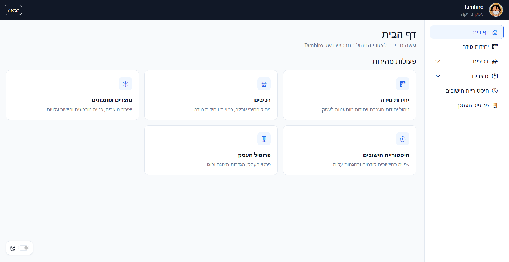

## Table of Contents

- [Overview](#overview)
- [Core Features](#core-features)
- [Architecture](#architecture)
- [Technology Stack](#technology-stack)
- [Database Design](#database-design)
- [Cost Calculation Model](#cost-calculation-model)
- [Security](#security)
- [Project Structure](#project-structure)
- [Getting Started](#getting-started)
- [Web API](#web-api)
- [Screenshots](#screenshots)
- [Deployment Notes](#deployment-notes)
- [Current Scope](#current-scope)

## Overview

Tamhiro helps small businesses understand the real cost of the products they create. The system connects ingredient purchase data, measurement-unit conversions, product recipes, and historical cost snapshots into one structured workflow.

Business owners can record ingredient package prices and quantities, define products and their recipes, calculate each ingredient's cost contribution, and track how the total product cost changes over time.

The application is designed for a Hebrew-speaking audience and provides a responsive right-to-left interface with consistent navigation, light and dark themes, and business-specific settings.

## Core Features

- **Business registration and authentication** — Create a business account, sign in securely, maintain an authenticated session, and sign out safely.
- **Multi-business data isolation** — Every business-owned operation is scoped to the authenticated user’s business on the server.
- **Measurement-unit management** — Use shared system units or create business-specific units within compatible measurement families.
- **Ingredient management** — Record package prices, package quantities, and measurement units, with editing and recoverable deactivation.
- **Product and recipe builder** — Define product output quantities, attach recipe ingredients, enter preparation instructions, and manage complete recipes.
- **Automatic unit conversion** — Convert compatible weight, volume, and count quantities without premature rounding.
- **Cost calculation engine** — Calculate ingredient contributions, total recipe cost, cost per output unit, and configured VAT-inclusive values.
- **Recipe-specific cost overrides** — Apply an approved manual ingredient-cost override without modifying the ingredient’s permanent package price.
- **Historical cost snapshots** — Preserve calculation results so later ingredient or recipe changes do not alter previous records.
- **Cost-change explanations** — Compare calculations and identify price, quantity, recipe, and override changes affecting the total.
- **Cost trend analysis** — Filter calculation history by date and visualize product-cost changes using interactive charts.
- **Business profile management** — Update business information, configure product display preferences, and upload a validated business logo.
- **Recycle bins** — Restore deactivated ingredients and products without recreating their data.
- **Rich-text instructions** — Create formatted product preparation instructions through TinyMCE with server-side HTML sanitization.
- **Hebrew RTL interface** — Use a consistent right-to-left layout with responsive navigation and light or dark themes.
- **Web API integration** — Retrieve product-builder data and preview ingredient costs through authenticated API endpoints.

## Architecture

Tamhiro follows a three-layer architecture inside a single ASP.NET Web Forms project. Each layer has a defined responsibility, and dependencies flow in one direction.

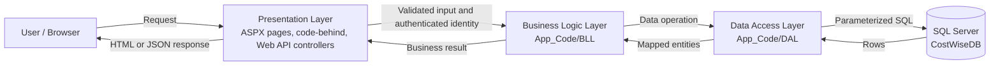

### Presentation Layer

The Presentation Layer contains:

- ASPX pages.
- Code-behind files.
- Web Forms controls.
- The shared Master Page.
- Web API controllers.
- API DTO classes.
- JavaScript and CSS files.

This layer receives user input, displays results, manages page behavior, and calls the BLL.

It does not:

- Contain SQL.
- Access the database directly.
- Call DAL classes directly.
- Perform business calculations.
- Treat a client-provided `BusinessId` as trusted identity.

### Business Logic Layer

The BLL is located in:

```text
App_Code/BLL
```

It contains:

- Business entities.
- Input validation.
- Authentication rules.
- Authorization and ownership checks.
- Measurement-unit conversions.
- Ingredient and product cost calculations.
- Historical comparison logic.
- Application-specific business rules.

The BLL receives the authenticated user identity from Presentation, validates the requested operation, and calls the appropriate DAL method.

### Data Access Layer

The DAL is located in:

```text
App_Code/DAL
```

It uses ADO.NET with:

- `SqlConnection`
- `SqlCommand`
- `SqlDataReader`
- Parameterized SQL commands.
- SQL transactions.

The DAL retrieves and persists data, applies business-scoped database filters, and maps database rows into BLL entities.

It does not contain user-interface logic or business calculations.

### Database

The SQL Server database is named:

```text
CostWiseDB
```

It stores businesses, users, measurement units, ingredients, products, recipes, and immutable calculation snapshots.

A typical request follows this flow:

```text
User action
→ ASPX page or Web API controller
→ BLL validation and business rules
→ DAL parameterized database operation
→ SQL Server
→ DAL entity mapping
→ BLL result
→ Presentation response
```

> Files under `App_Code` use the `Content` build action because ASP.NET dynamically compiles this folder at runtime.

## Technology Stack

### Backend

- **C# and .NET Framework 4.8** — Core application language and runtime.
- **ASP.NET Web Forms** — Server-rendered pages, controls, page lifecycle, code-behind, and Master Page layout.
- **ASP.NET Web API 2 (5.2.9)** — Session-aware HTTP endpoints used by the product-building workflow.
- **ADO.NET** — Direct database access through `SqlConnection`, `SqlCommand`, `SqlDataReader`, and SQL transactions.
- **Forms Authentication and Session State** — Authenticated navigation and minimal server-side identity state.

### Frontend

- **HTML5, CSS3, and JavaScript** — Application structure, styling, and browser-side interactions.
- **Bootstrap RTL 5.3.8** — Responsive right-to-left layout and reusable interface components.
- **Bootstrap Icons 1.13.1** — Navigation and action icons.
- **TinyMCE 8.8.2** — Rich-text editing for product preparation instructions.
- **Chart.js 4.5.1** — Interactive visualization of historical product-cost trends.

### Data and Security

- **Microsoft SQL Server** — Relational persistence through the `CostWiseDB` database.
- **LocalDB** — Local SQL Server development environment.
- **Parameterized SQL** — Protection against SQL injection across data-access operations.
- **PBKDF2-SHA256** — Password hashing with a random salt and 600,000 iterations.
- **HtmlSanitizer 9.1.973** — Sanitization of rich-text HTML before persistence and display.
- **AngleSharp** — HTML and CSS parsing used by the sanitization workflow.
- **Newtonsoft.Json 13.0.3** — JSON serialization for Web API and chart data.

## Database Design

Tamhiro uses the `CostWiseDB` SQL Server database. The schema separates current business data from immutable historical calculation snapshots.

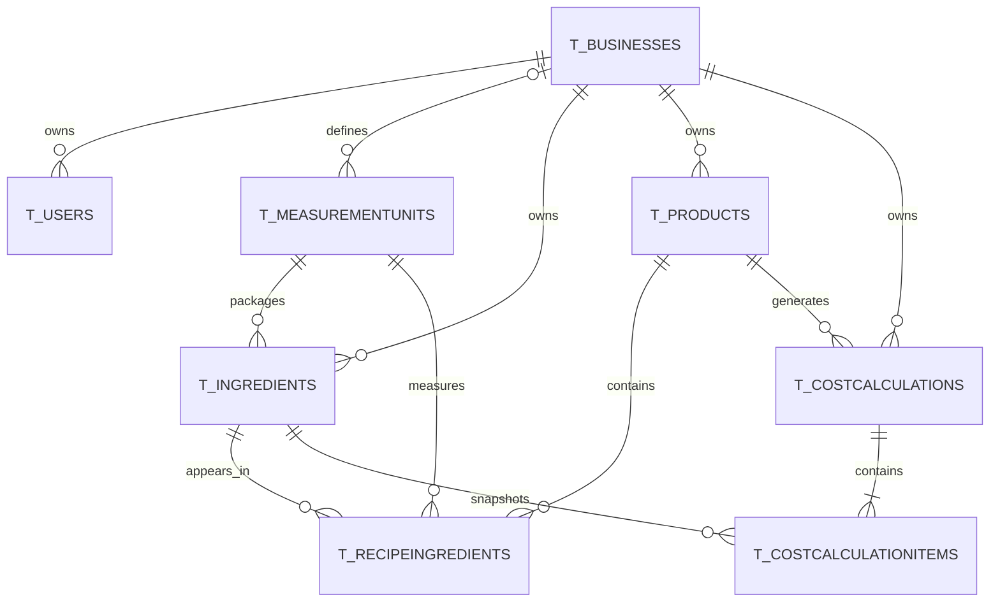

### Main Tables

- **`T_Businesses`** — Business identity, profile settings, logo path, VAT configuration, and product-display preferences.
- **`T_Users`** — Local authenticated users linked to their businesses.
- **`T_MeasurementUnits`** — Shared system units and custom business-owned units with family and base-conversion information.
- **`T_Ingredients`** — Current ingredient package prices, package quantities, units, and active state.
- **`T_Products`** — Product yield, instructions, image path, active state, and current calculated totals.
- **`T_RecipeIngredients`** — The ingredients, quantities, units, ordering, and approved overrides that form a product recipe.
- **`T_CostCalculations`** — Immutable calculation headers containing product, yield, VAT, total-cost, and calculation-time snapshots.
- **`T_CostCalculationItems`** — Immutable ingredient-level snapshots containing historical quantities, prices, units, conversion factors, and cost contributions.

All primary keys use:

```text
IDENTITY(1000,17)
```

Foreign keys preserve the relationships between businesses, products, ingredients, recipes, and calculation snapshots.

System measurement units have `BusinessId = NULL` and are shared across businesses. Custom measurement units contain a valid `BusinessId` and are available only to their owning business.

The built-in system units are:

- Gram.
- Kilogram.
- Milliliter.
- Liter.
- Unit.

## Cost Calculation Model

All prices, quantities, conversion factors, and calculated values use `decimal`. Intermediate results are not rounded prematurely.

### Unit Conversion

Each compatible measurement unit defines a conversion factor relative to its family’s base unit.

```text
Package quantity in base units
= Package quantity × Package-unit conversion factor
```

```text
Recipe quantity in base units
= Recipe quantity × Recipe-unit conversion factor
```

Conversions are allowed only within the same measurement family:

- Weight can be converted only to weight.
- Volume can be converted only to volume.
- Count can be converted only to compatible count units.

### Ingredient Cost

After both quantities are converted into the same base unit, the ingredient contribution is calculated as:

```text
Ingredient cost
= Recipe quantity in base units
÷ Package quantity in base units
× Package price
```

When an approved recipe-specific manual cost override exists, the override replaces the automatically calculated ingredient contribution without changing the ingredient’s permanent package price.

### Product Cost

```text
Total recipe cost
= Sum of all ingredient cost contributions
```

```text
Cost per output unit
= Total recipe cost ÷ Product yield quantity
```

When VAT display is enabled for the business:

```text
Total cost including VAT
= Total recipe cost × (1 + VAT rate ÷ 100)
```

```text
Cost per output unit including VAT
= Cost per output unit × (1 + VAT rate ÷ 100)
```

### Calculation Validation

The BLL prevents a calculation when:

- The authenticated user does not own the requested product or related records.
- The recipe is empty.
- The product yield is zero or negative.
- A package or recipe quantity is zero or negative.
- A package price is negative.
- A conversion factor is zero or negative.
- Measurement-unit families are incompatible.
- A required ingredient, product, or measurement unit is unavailable.

Every saved calculation stores the product, yield, VAT, ingredient, quantity, unit, conversion-factor, package-price, and cost values used at calculation time.

These immutable snapshots ensure that later changes do not rewrite historical results.

## Security

Tamhiro applies security controls across Presentation, BLL, DAL, and database operations.

### Authentication

- Passwords are never stored as plain text.
- Passwords are hashed using `PBKDF2-SHA256`.
- Every password receives a random 16-byte salt.
- Password derivation uses 600,000 iterations.
- The generated hash is 32 bytes long.
- Password verification uses a fixed-time byte comparison.
- Authentication state is maintained through Forms Authentication and server-side Session state.

### Business Isolation

Tamhiro is a multi-business system. Every user belongs to one business.

The server stores minimal authenticated identity values such as:

```text
UserId
BusinessId
UserName
```

Critical operations use the authenticated `UserId` to retrieve and verify the owning business.

A `BusinessId` received from a form, query string, URL, JavaScript request, hidden field, or API request is never treated as trusted authorization.

Every business-owned read operation is filtered by the authenticated business. Updates and deactivations verify ownership in addition to checking the record identifier.

### Database Security

- SQL commands use parameters instead of concatenating user input.
- Database connections are created only inside the DAL.
- Multi-record operations use transactions where atomic behavior is required.
- Presentation does not contain SQL or open database connections.
- Internal database exceptions are not intentionally exposed to users.

### Content and Upload Security

- TinyMCE HTML is sanitized on the server before it is stored or displayed.
- Business-logo uploads accept approved JPEG and PNG files.
- Upload size is limited.
- File headers and extensions are validated.
- Stored files receive safely generated names.
- Upload paths are controlled by the server to prevent path traversal.

## Project Structure

```text
CostWise/
├── README.md
└── CostWise/
    ├── CostWise.sln
    └── CostWise/
        ├── App_Code/
        │   ├── BLL/
        │   ├── DAL/
        │   └── Controllers/
        ├── App_Start/
        ├── Content/
        ├── Models/
        ├── Scripts/
        ├── Uploads/
        │   └── BusinessLogos/
        ├── BusinessProfile.aspx
        ├── CalculationHistory.aspx
        ├── Dashboard.aspx
        ├── IngredientRecycleBin.aspx
        ├── Ingredients.aspx
        ├── Login.aspx
        ├── MeasurementUnits.aspx
        ├── ProductRecycleBin.aspx
        ├── Products.aspx
        ├── Register.aspx
        ├── Site.Master
        ├── Global.asax
        ├── packages.config
        ├── Web.config
        └── CostWise.csproj
```

## Getting Started

### Prerequisites

Install the following software:

- Windows 10 or Windows 11.
- Visual Studio 2022.
- The **ASP.NET and web development** Visual Studio workload.
- The .NET Framework 4.8 targeting pack.
- Microsoft SQL Server LocalDB or another compatible SQL Server instance.
- NuGet package restore support.

### 1. Clone the Repository

```bash
git clone https://github.com/Yaron-semanyotin/CostManagementProject.git
cd CostManagementProject
```

### 2. Open the Solution

Open the following solution in Visual Studio:

```text
CostWise/CostWise.sln
```

### 3. Restore NuGet Packages

Allow Visual Studio to restore the packages listed in:

```text
CostWise/CostWise/packages.config
```

If automatic restoration does not start, right-click the solution and select:

```text
Restore NuGet Packages
```

### 4. Configure the Database

The development configuration expects a LocalDB database named:

```text
CostWiseDB
```

The default connection string is located in:

```text
CostWise/CostWise/Web.config
```

Default development value:

```xml
<add
  name="CostWiseConnectionString"
  connectionString="Data Source=(LocalDB)\MSSQLLocalDB;Initial Catalog=CostWiseDB;Integrated Security=True"
  providerName="System.Data.SqlClient" />
```

The database must contain these tables:

```text
T_Businesses
T_Users
T_MeasurementUnits
T_Ingredients
T_Products
T_RecipeIngredients
T_CostCalculations
T_CostCalculationItems
```

It must also contain the five system measurement units.

> The repository currently does not contain a versioned database-creation script. Provision or restore the expected `CostWiseDB` schema before running the application.

### 5. Build the Project

In Visual Studio, select:

```text
Build → Build Solution
```

Confirm that the solution builds successfully before running it.

### 6. Run the Application

Set the Web Forms project as the startup project and run it with IIS Express.

The application should open at the login page. New users can select the registration link to create a business account.

### 7. Verify the Main Workflow

A basic verification flow is:

```text
Register a business
→ Log in
→ Review system measurement units
→ Add an ingredient
→ Create a product
→ Build its recipe
→ Review the calculated cost
→ Save a calculation
→ Open calculation history
```

## Web API

Tamhiro exposes authenticated Web API 2 endpoints for the product-building interface.

All endpoints require a valid authenticated Session cookie. The API resolves the current user from the server-side Session and calls only the BLL.

### Retrieve Product-Builder Data

```http
GET /api/product-builder-data
```

Optional query parameter:

```http
GET /api/product-builder-data?productId=1000
```

The response contains:

- Ingredients available to the authenticated business.
- Measurement units available to the authenticated business.
- The business’s default recipe measurement-unit identifier.

Example response:

```json
{
  "Ingredients": [
    {
      "IngredientId": 1000,
      "IngredientName": "Sugar",
      "PackagePrice": 8.50,
      "PackageQuantity": 1.00,
      "PackageUnitId": 1017,
      "IsActive": true
    }
  ],
  "MeasurementUnits": [
    {
      "MeasurementUnitId": 1000,
      "UnitName": "Gram",
      "UnitFamily": "Weight"
    }
  ],
  "DefaultRecipeMeasurementUnitId": 1000
}
```

### Preview an Ingredient Cost

```http
POST /api/product-builder-data/ingredient-cost-preview
Content-Type: application/json
```

Example request:

```json
{
  "ProductId": 1000,
  "IngredientId": 1017,
  "Quantity": 250.0,
  "MeasurementUnitId": 1000
}
```

Example response:

```json
{
  "CalculatedCost": 2.13
}
```

The BLL validates the authenticated user, product ownership, ingredient ownership, measurement-unit availability, compatible unit families, and positive quantities before returning a result.

### API Status Codes

- **`200 OK`** — The operation completed successfully.
- **`400 Bad Request`** — Input or business validation failed.
- **`401 Unauthorized`** — The authenticated Session is missing or invalid.
- **`500 Internal Server Error`** — An unexpected internal error occurred.

## Screenshots

The screenshots below show the Hebrew RTL interface with sample development data.

<details>
<summary><strong>Authentication</strong></summary>

<br>

<p align="center">
  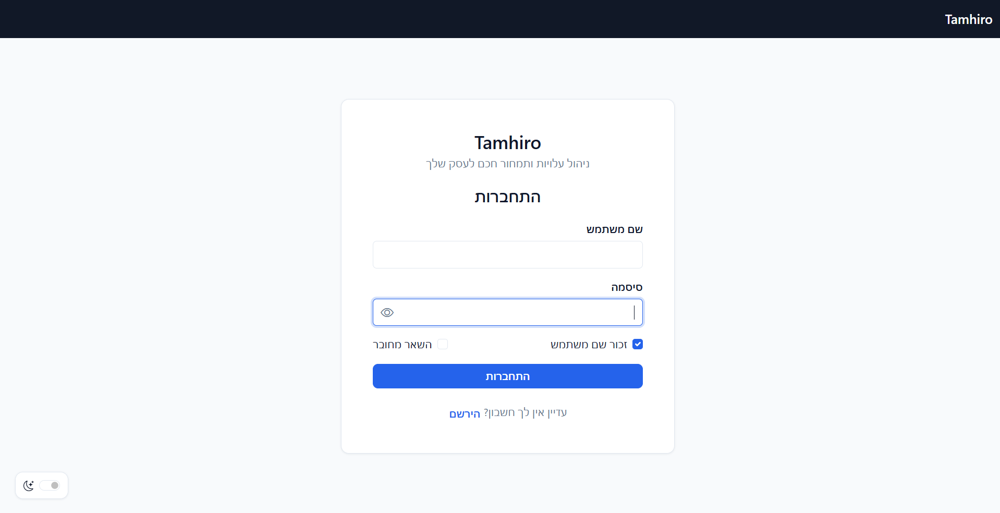
  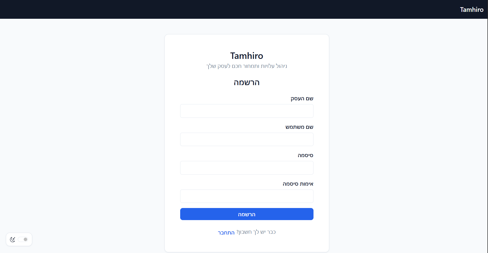
</p>

</details>

<details>
<summary><strong>Measurement Units and Ingredients</strong></summary>

<br>

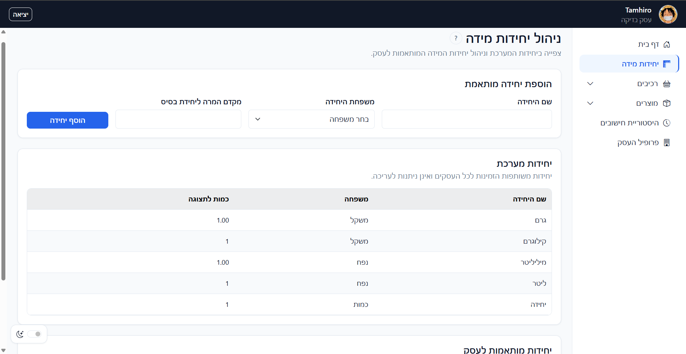

<br><br>

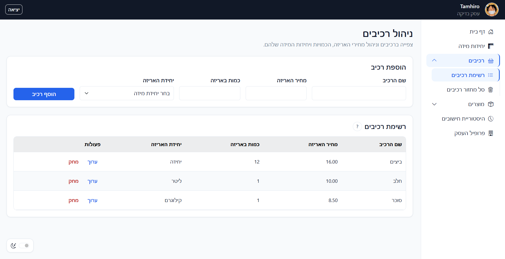

<br><br>

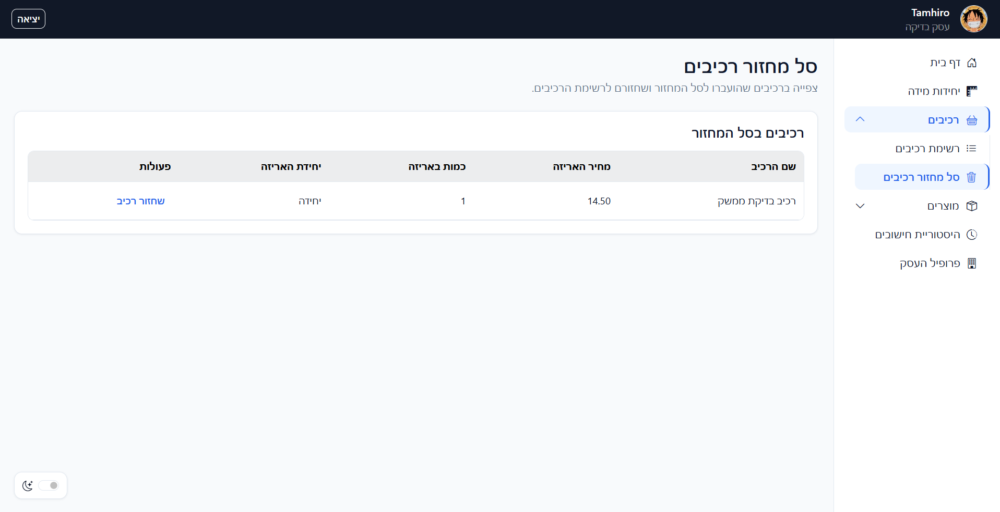

</details>

<details>
<summary><strong>Products and Recipes</strong></summary>

<br>

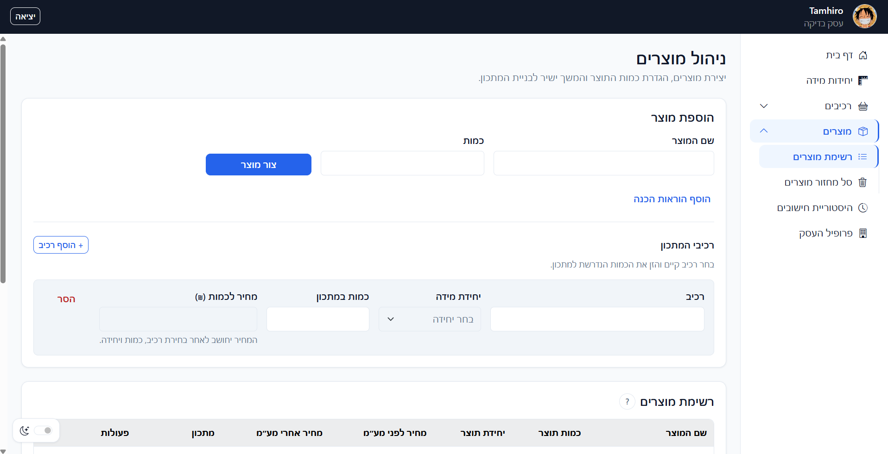

<br><br>

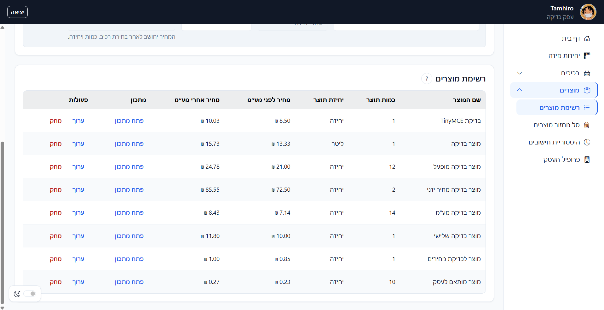

<br><br>

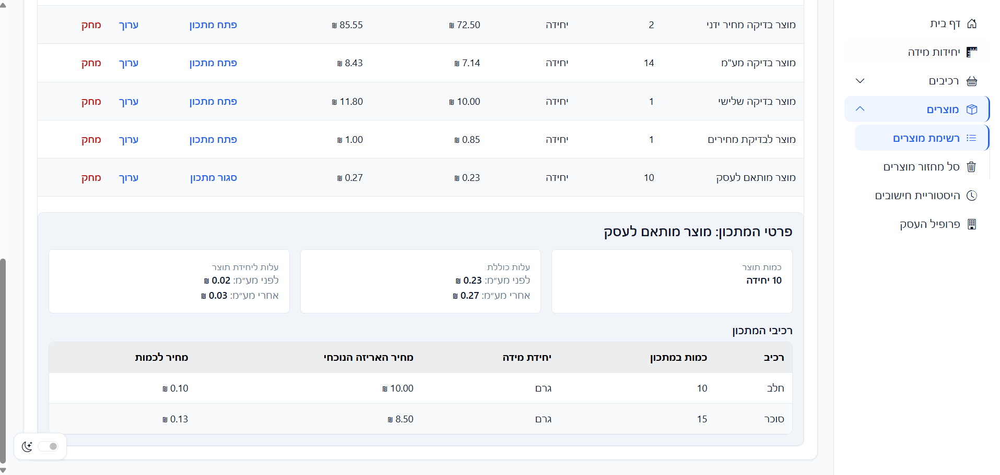

<br><br>

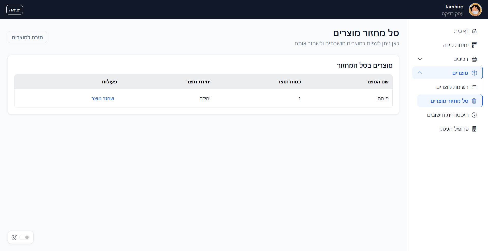

</details>

<details>
<summary><strong>Calculation History</strong></summary>

<br>

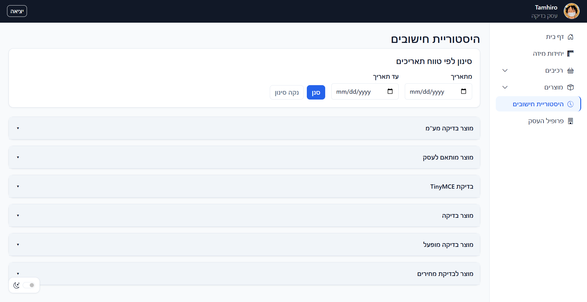

<br><br>

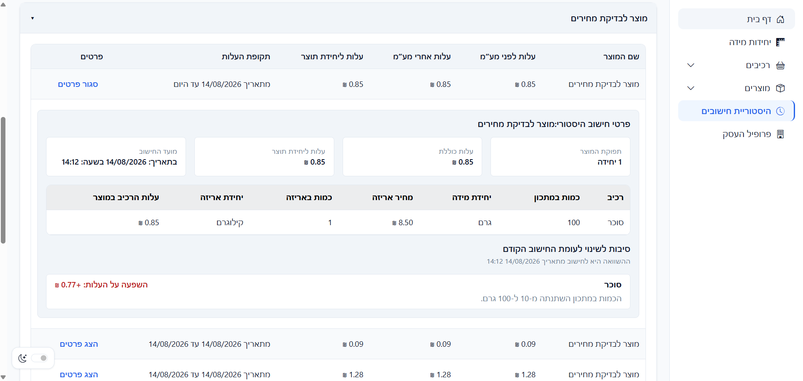

<br><br>

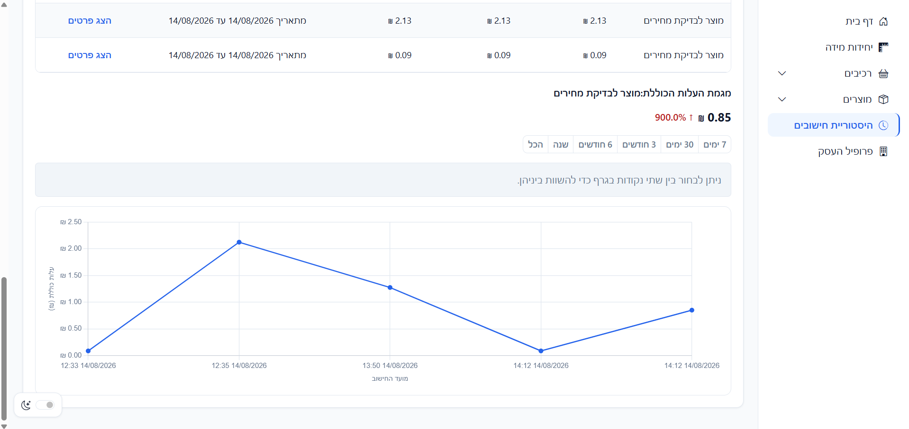

</details>

<details>
<summary><strong>Business Profile</strong></summary>

<br>

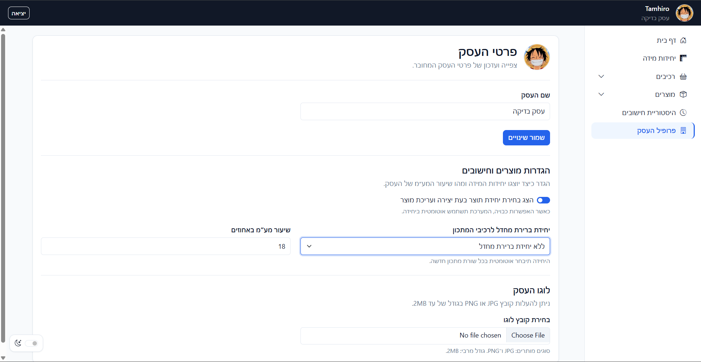

</details>

## Deployment Notes

Production hosting must support:

- ASP.NET on .NET Framework 4.8.
- SQL Server.
- IIS or another compatible ASP.NET hosting environment.
- HTTPS.
- Write access to the approved upload directory.

Before production deployment:

1. Replace the LocalDB connection string with a secure production SQL Server connection string.
2. Do not commit production credentials or secrets to Git.
3. Disable debug compilation.
4. Enable HTTPS and secure authentication-cookie settings.
5. Configure production error pages without detailed exception output.
6. Confirm that the upload directory has only the required permissions.
7. Verify registration, login, business isolation, CRUD operations, calculations, history, uploads, TinyMCE, and Web API behavior.
8. Test the application using at least two different businesses.

LocalDB must not be used as the production database.

## Current Scope

The current version focuses on ingredient-based product costing for small businesses.

It includes:

- Businesses and local users.
- Registration, login, logout, and Session-based authentication.
- Measurement units and compatible unit conversions.
- Ingredient package prices and quantities.
- Products and recipes.
- Ingredient, recipe, and output-unit cost calculations.
- VAT-aware cost presentation.
- Historical calculation snapshots and change analysis.
- Business profile and logo upload.
- Rich-text preparation instructions.
- Authenticated Web API operations.
- Hebrew RTL user interface.

The current scope does not include:

- Inventory management.
- Supplier management or supplier comparisons.
- Labor costs.
- Packaging costs.
- Shipping costs.
- Equipment depreciation.
- Employee accounts or advanced roles.
- External price-list imports.
- Payment processing.
- AI integrations.